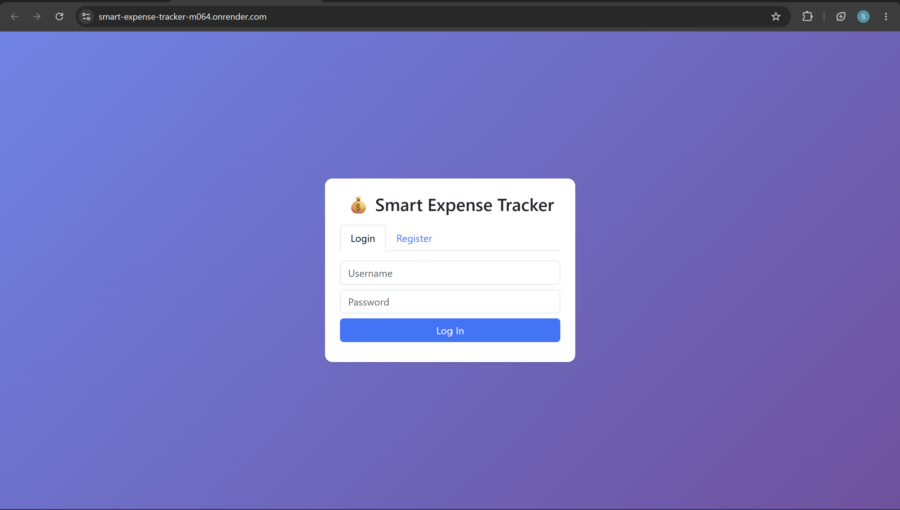
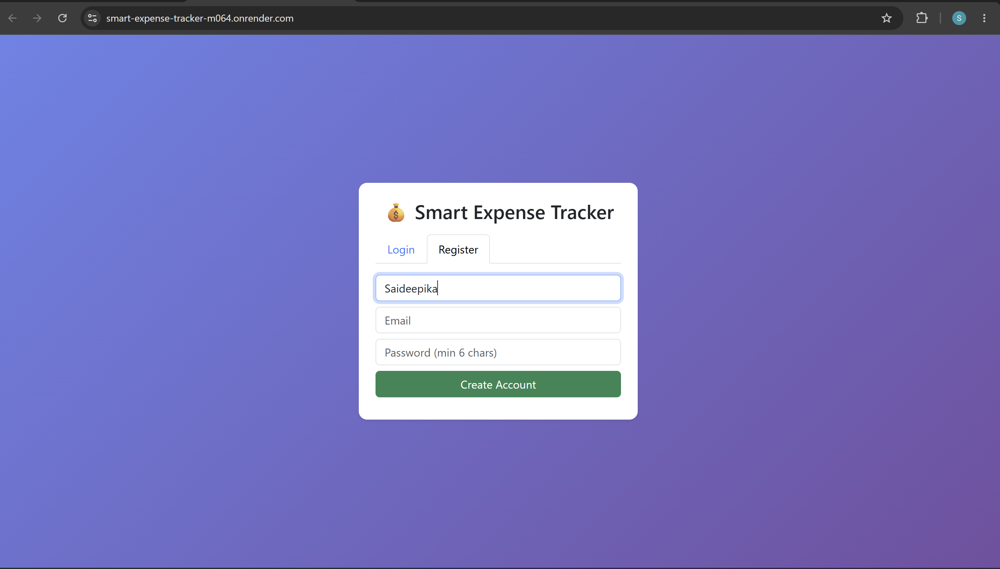
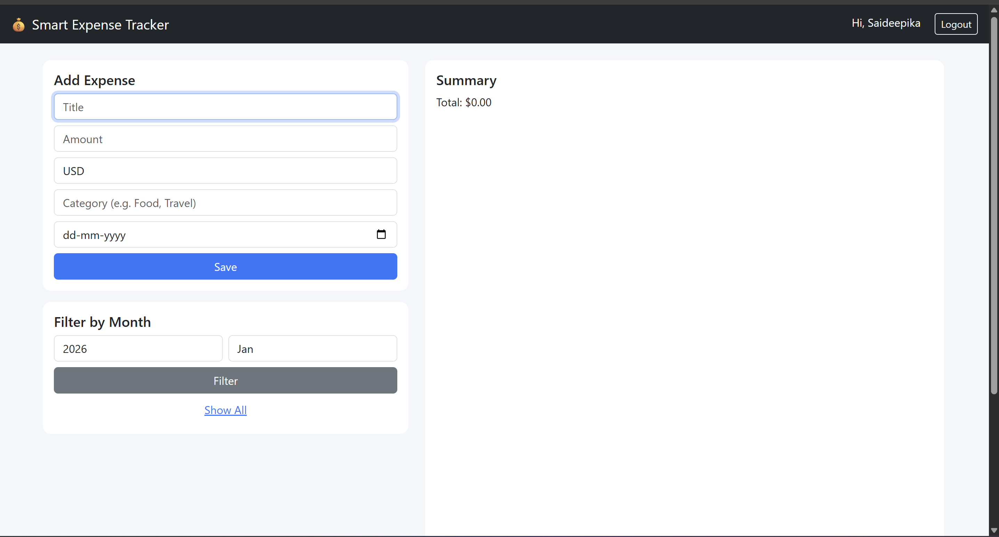
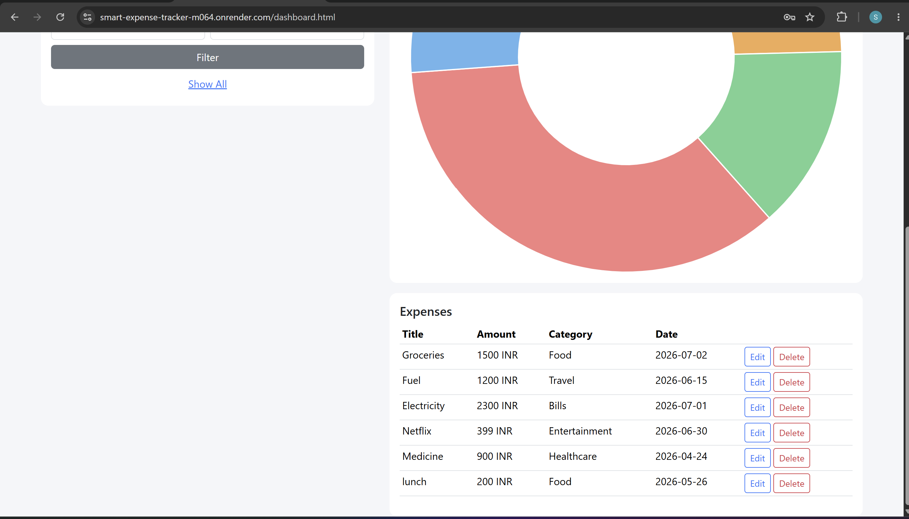
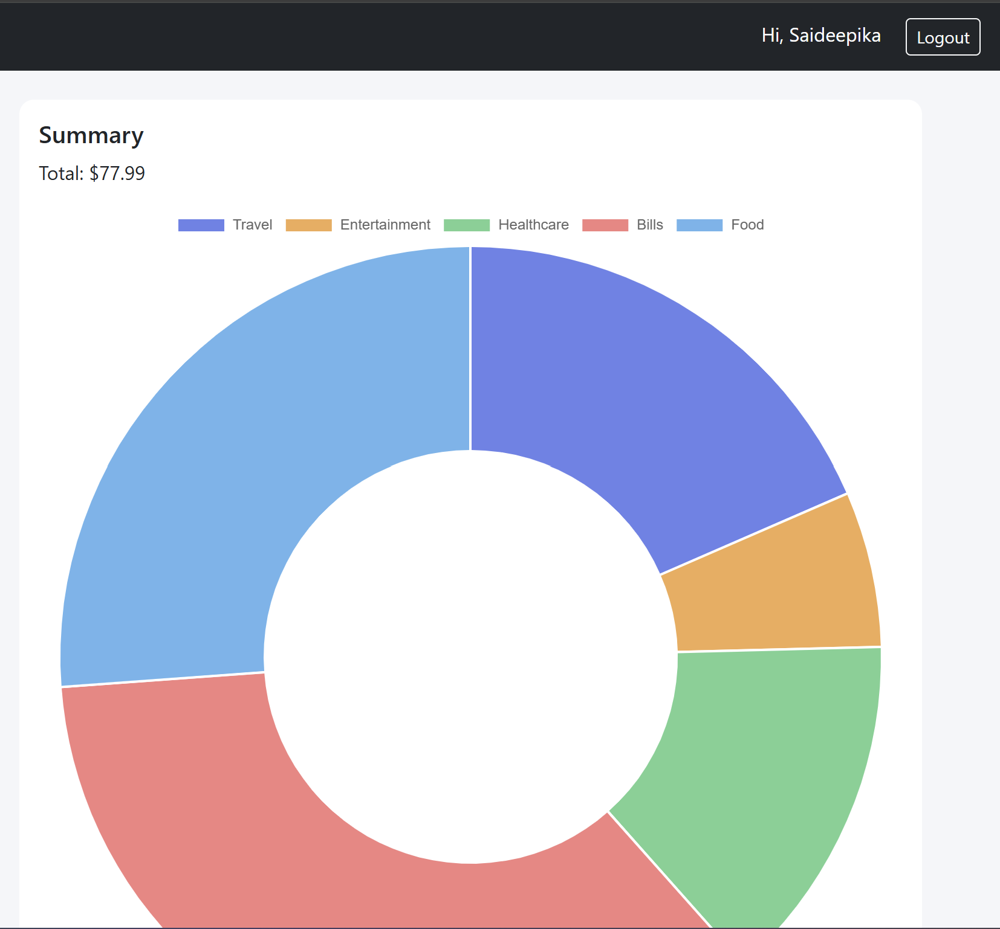

#  Smart Expense Tracker

A full-stack **Expense Tracker** application built with **Spring Boot**, **Spring Security (JWT)**, **H2 Database**, **HTML**, **CSS**, **JavaScript**, and **Chart.js**.

This application enables users to securely register, log in, manage their daily expenses, monitor spending, and visualize financial data through interactive charts.

---

##  Live Demo

 **https://smart-expense-tracker-m064.onrender.com**

> **Note:** Since the application is hosted on Render's free tier, the first request after inactivity may take 30–60 seconds while the service wakes up.

---

##  Screenshots

###  Login Page



---

###  Registration Page



---

###  Dashboard



---

###  Expense List



---

###  Expense Chart



#  Features

- Secure User Registration
- JWT-based Authentication
- User Login & Logout
- Add New Expenses
- Update Existing Expenses
- Delete Expenses
- View Expense History
- Expense Summary Dashboard
- Interactive Expense Charts
- Category-wise Expense Tracking
- Responsive User Interface
- Secure REST APIs
- Password Encryption using BCrypt

---

#  Tech Stack

### Backend

- Java 17
- Spring Boot
- Spring Security
- Spring Data JPA
- Hibernate
- JWT Authentication
- Maven

### Frontend

- HTML5
- CSS3
- JavaScript
- Chart.js

### Database

- H2 Database

### Deployment

- Docker
- Render

---

#  Project Structure

```
smart-expense-tracker
│
├── src
│   ├── main
│   │   ├── java
│   │   ├── resources
│   │   │   ├── static
│   │   │   └── application.properties
│   └── test
│
├── Dockerfile
├── pom.xml
├── README.md
└── .gitignore
```

---

#  Getting Started

## Clone the Repository

```bash
git clone https://github.com/deepika8-hub/smart-expense-tracker.git
cd smart-expense-tracker
```

---

## Build the Project

Linux / macOS

```bash
./mvnw clean package
```

Windows

```bash
mvnw.cmd clean package
```

---

## Run the Application

```bash
java -jar target/smart-expense-tracker-0.0.1-SNAPSHOT.jar
```

Open your browser and visit:

```
http://localhost:8080
```

---

# Authentication

The application uses **JSON Web Tokens (JWT)** to secure protected APIs.

Authentication flow:

- Register a new account
- Login using your credentials
- Receive a JWT token
- Use the token to access secured endpoints

---

# REST API Endpoints

## Authentication

| Method | Endpoint |
|----------|-----------------------|
| POST | `/api/auth/register` |
| POST | `/api/auth/login` |

### Expenses

| Method | Endpoint |
|----------|------------------------|
| GET | `/api/expenses` |
| POST | `/api/expenses` |
| PUT | `/api/expenses/{id}` |
| DELETE | `/api/expenses/{id}` |

### Summary

| Method | Endpoint |
|----------|----------------------------|
| GET | `/api/expenses/summary` |

---

#  Security

- Spring Security
- JWT Authentication
- BCrypt Password Encryption
- Protected REST APIs
- User-specific Expense Management

---

#  Deployment

The application is containerized using **Docker** and deployed on **Render**.

**Live URL**

https://smart-expense-tracker-m064.onrender.com

---

#  Future Enhancements

- PostgreSQL Database Integration
- Monthly Budget Planning
- Expense Export to PDF/Excel
- Email Verification
- Password Reset
- Recurring Expense Management
- Dark Mode
- User Profile Management
- Multi-language Support
- AI-powered Expense Insights

---

#  Author

**Sai Deepika R**

**GitHub:**  
https://github.com/deepika8-hub

**Project Repository:**  
https://github.com/deepika8-hub/smart-expense-tracker

